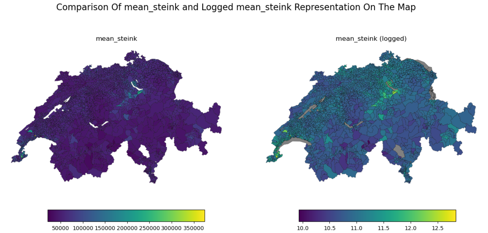
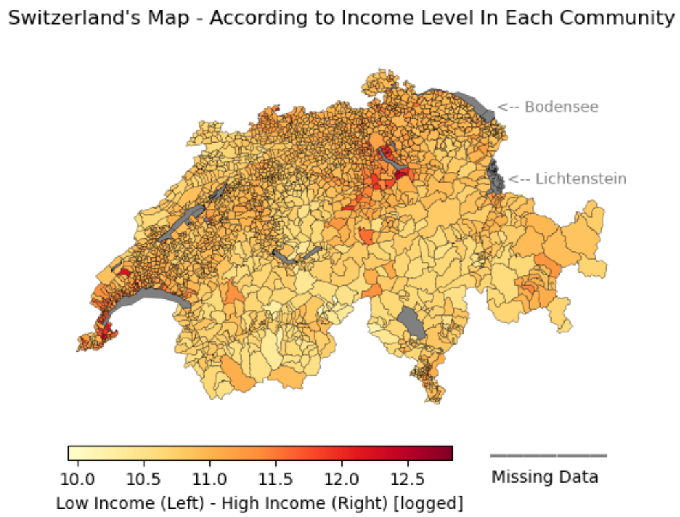
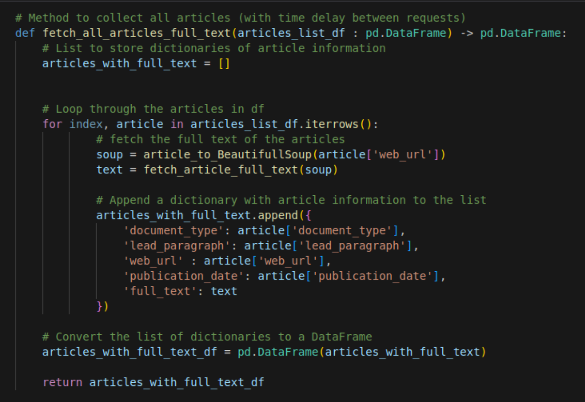
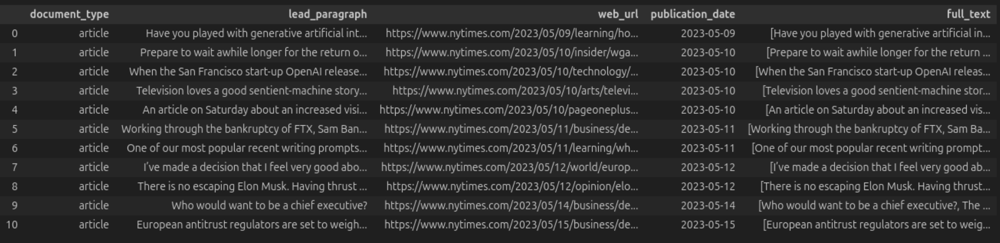
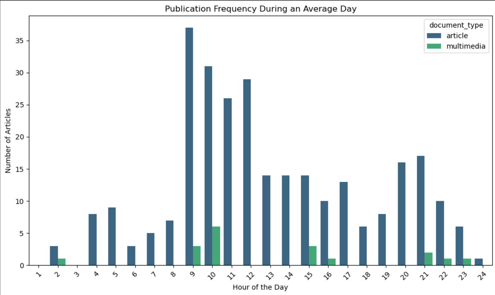
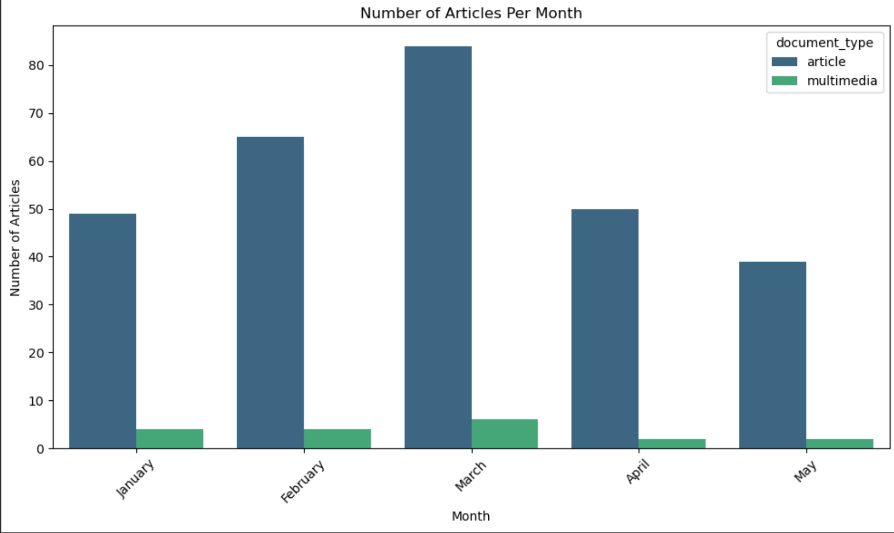

# Visualisation Of Data with GeoPandas  &  Web Scraping With BeautifulSoup And NYT API

## Data Visualisation 

This exercise shows an example of working with Geopandas to visualise real word data by comparing and displaying the income of the different Swiss municipalities. 

## Web Scraping
It also shows a use case of web scraping, namely extracting the text of all articles with a specific word in the title and/or text from the New York Times using BeautifulSoup and the NYT API.

## Packages
Here a list of required packages:
- numpy
- pandas
- geopandas
- matplotlib.pyplot
- matplotlib.image
- os
- requests
- BeautifulSoup
- time
- json

## Brief Look Of The Outcome
#### Data Visualisation - GeoPandas
 

#### Web Scraping - BeautifulSou, NYT API
 

